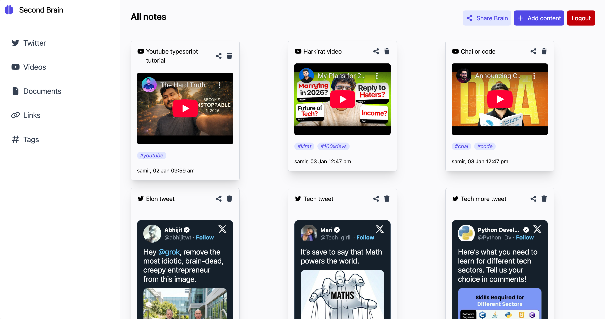
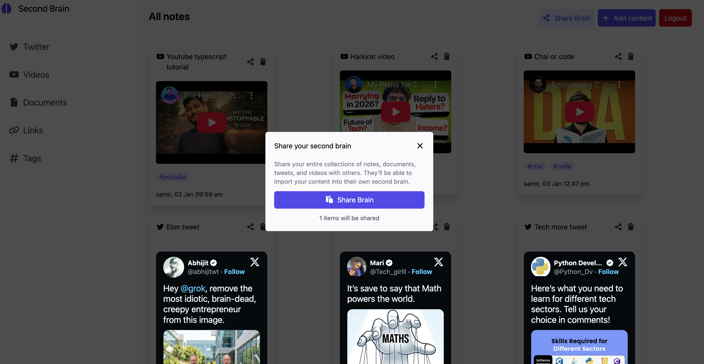
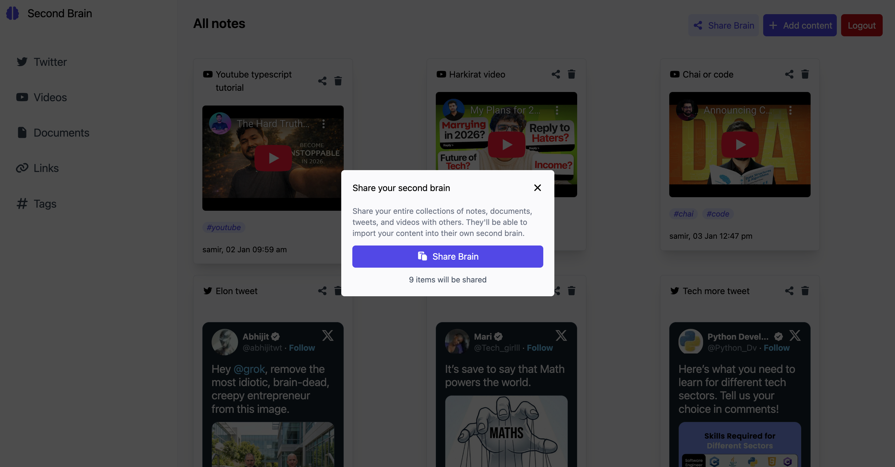
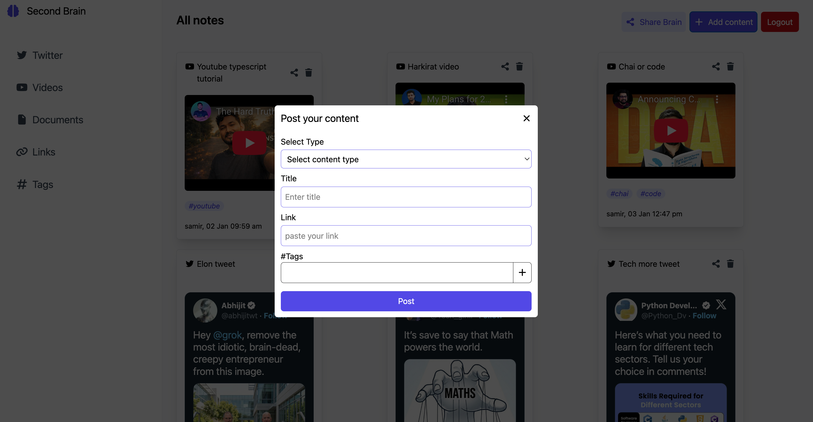
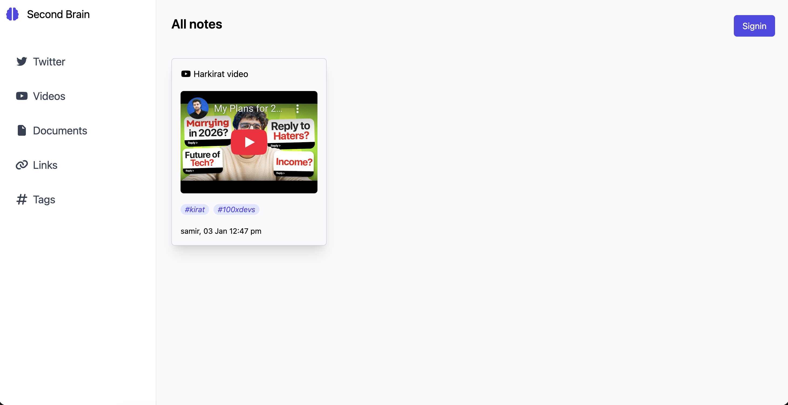

# 🧠 Second Brain – Personal Knowledge Management App

Second Brain is a full-stack personal knowledge management application that allows users to collect, organize, and share information from multiple sources in one centralized place. The platform is designed to act as a digital “second brain”, helping users store and retrieve knowledge efficiently.

Users can securely create an account, upload different types of content, organize them using tags, and share their knowledge publicly through unique links — even with users who are not logged in.

## 🌐 Live Demo
🔗 [View Live Project](https://second-brain-frontend-evno.onrender.com)

---

## 🚀 Tech Stack

- **Frontend**:
    - React
    - TypeScript
    - React Router
    - Redux Toolkit
    - Tailwind CSS
    - React Tweet
    - Zod (form validation)

- **Backend**:
    - Node.js
    - Express.js
    - TypeScript
    - MongoDB (Mongoose)
    - JWT (authentication)
    - Bcrypt (password hashing)
    - Zod
    - CORS
    - Dotenv

---
## 🚀 Features

- **User Authentication**:
    - Sign up, Login, Logout
    - Secure JWT-based authentication

- **Content Management**:
    - Upload and store:
    - Text notes
    - Links
    - Tweets
    - YouTube videos
    - PDF files
    - Tag-based organization for better categorization

- **Brain Management**:
    - Delete individual items
    - Delete entire brain

- **Sharing**:
    - Share the complete brain
    - Share a single brain item
    - Public share links accessible without authentication

- **Validation & Security**:
    - Input validation using Zod
    - Password hashing with Bcrypt
    - Protected routes and secure APIs

---


## 📦 Folder Structure (Simplified)
/frontend 
    /src 
        /components 
        /pages 
        /redux 
        /schema
        app.tsx 
    .env

/backend 
    /src
        /config
        /controllers 
        /models 
        /routes 
        /middlewares 
        /schema
        index.ts

---


---

## 🛠 Installation & Setup

1. **Clone the Repository**:
    ```bash
    https://github.com/warsi0707/SECOND-BRAIN
    ```
2. **Install Dependecies**:
    ```bash
    cd frontend
    npm install
    ```
    ```bash
    cd backend
    npm install
    ```
3. **Setup Environment Variables**:
    ```bash
    Create a .env file in /backend:
    MONGO_URL =
    USER_JWT_SECRET = 
    FRONTEND_URL = 

    Create a .env file in /frontend:
    VITE_BACKEND_URL = 
    ```

4. **Run the App**:
    Frontend
    npm run dev

    Backend
    npm start


## Screenshots

### Homepage


### Signin


### Signup


### Share One Brain and all brain



### Upload Page


### Shared page



